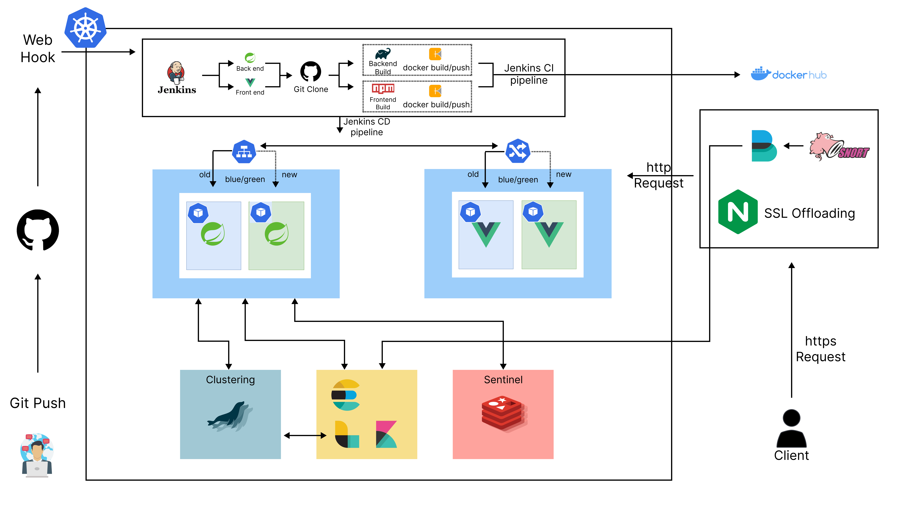
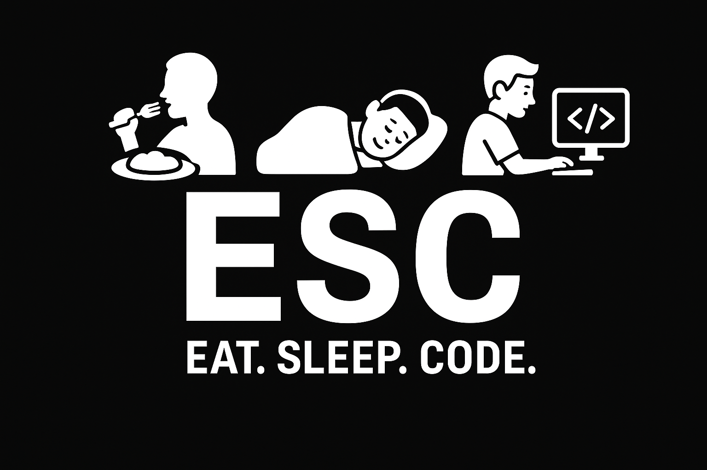
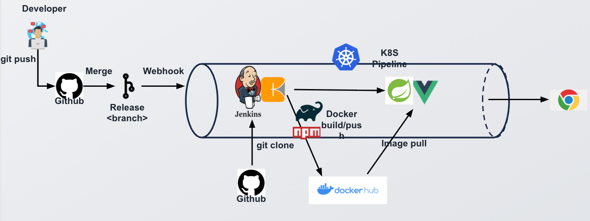
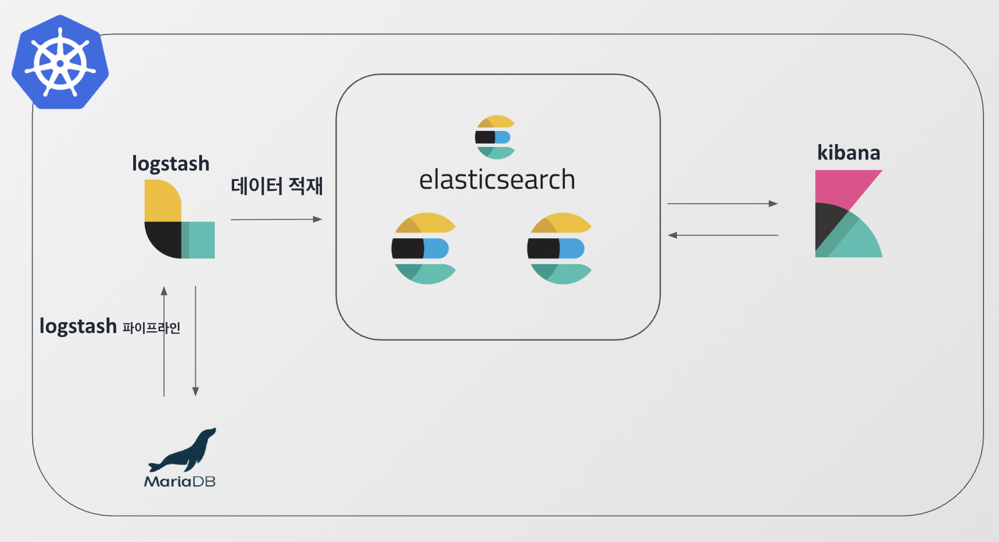

  

# 📌 4Weekdays

> 공급업체의 납품부터 발주, ASN, 입고, 작업, 재고, 출고까지 이어지는 흐름을 하나의 데이터 체계로 관리하기 위해 만든 창고 관리 플랫폼입니다.

- 기간: 2025.09 ~ 2025.11
- 구성: 4인 팀 프로젝트 / 팀장
- [4Weekdays 링크](https://www.4weekdays.kro.kr)
- [프론트엔드 Repository](https://github.com/tipsyboy/ESC-4Weekdays-FE)
- [백엔드 Repository](https://github.com/tipsyboy/ESC-4Weekdays-BE)

## 시스템 아키텍처

  

## 👨‍💻 ESC 팀원 구성

  

<table align="center">
  <tbody>
    <tr>
      <td align="center">
        
         <b>양형모</b>
      </td>
      <td align="center">
        
         <b>강설</b>
      </td>
      <td align="center">
        
         <b>김원중</b>
      </td>
      <td align="center">
        
         <b>이현식</b>
      </td>
    </tr>
  </tbody>
</table>

---

# 🙋 담당

## 👤 역할

### Backend

- Kubernetes 기반 배포 환경 구성
- Jenkins 기반 CI/CD 자동화
- 인증/인가 구조 설계 및 구현
- 상품, 입고, 재고, 작업 도메인 API 개발
- 검색 기능 설계 및 Elasticsearch 연동

### Frontend

- 주요 화면 설계
- API 연동 구조 정리
- 재사용 가능한 화면 템플릿 가이드 작성

## 🔥 주요 기여

### 1️⃣ Kubernetes 기반 배포 인프라 구축 및 CI/CD 자동화

  

- Kubernetes 클러스터 구축 및 서비스 운영 환경 마련
- GitHub Webhook과 Jenkins를 연동해 CI/CD 파이프라인 구성

#### 결과
- 수동 빌드·배포 과정의 반복과 실수 가능성을 파이프라인 자동화로 완화
- Grafana 기준 한 달간 서버 가동률 98.1% 달성

### 2️⃣ JWT 기반 인증/인가 서비스 구축

- K8s 다중 노드 환경을 고려한 JWT 기반 무상태 인증 구조 설계 및 구현
- Access Token, Refresh Token을 쿠키 기반으로 운영하도록 인증 흐름 구성
- 서버 필터에서 Refresh Token 자동 재발급 처리로 인증 요청 구조 단순화
- SSL 인증서 발급 및 HTTPS 환경 구축

#### 결과
- Kubernetes 다중 노드 환경에서 세션 상태 공유 문제를 무상태 구조로 전환해 해소
- 토큰 재발급 네트워크 왕복 3 → 1 단축

### 3️⃣ QueryDSL 기반 검색 최적화와 JPA 조회 성능 개선

- QueryDSL 도입으로 컴파일 시점 오류 체크 및 타입 안정성 확보
- BooleanExpression 모듈화를 통한 동적 필터링 로직 구현
- 연관관계 유형별 N+1 해결 전략 비교 및 최적안 적용

#### 결과
- 문자열 기반 쿼리 작성 방식에서 발생하던 유지보수성 문제를 개선
- 연관관계가 많은 조회 API에서 발생하던 N+1 문제를 완화
- 검색 조건 확장과 조회 성능 개선을 함께 고려할 수 있는 구조로 개선

### 4️⃣ Elasticsearch 검색 엔진 도입

  

- Elasticsearch를 도입해 역색인 기반 검색 구조 구성
- Logstash JDBC 플러그인 기반 MariaDB-ES 간 데이터 동기화 파이프라인 구축
- 제한된 서버 자원 안에서 운영 가능하도록 리소스와 JVM 메모리 튜닝

#### 결과
- `%LIKE%` 기반 검색의 구조적 성능 한계를 역색인 기반 검색으로 개선
- 상품 검색 응답 속도와 검색 경험을 함께 개선할 수 있는 기반 마련
- 제한된 서버 자원 내에서도 운영 가능한 검색 인프라 구성

## 주요 기능

- 공급업체 등록, 상태 관리, 상품 연계
- 발주 생성, 수정, 승인, 상태 추적
- ASN 수신 및 입고 예정 자동 생성
- 입고 검수와 적치 작업 생성 및 배정
- 로케이션별 재고 조회와 LOT 이력 추적
- 피킹, 패킹, 출하 작업 흐름 관리
- 상품, 재고, 발주, 입고 통합 검색

## 기술 스택

### Backend

### Data and Infra

### Test and Tooling

## 문서

- [📖 Wiki](https://github.com/beyond-sw-camp/be17-fin-ESC-4Weekdays-BE/wiki)
- [프로젝트 기획서](https://github.com/beyond-sw-camp/be17-fin-ESC-4Weekdays-BE/wiki/ESC-%E2%80%90-4WeekDays-%E2%80%90-%ED%94%84%EB%A1%9C%EC%A0%9D%ED%8A%B8-%EA%B8%B0%ED%9A%8D%EC%84%9C)
- [WBS](https://github.com/beyond-sw-camp/be17-fin-ESC-4Weekdays-BE/wiki/WBS)
- [ERD](https://github.com/beyond-sw-camp/be17-fin-ESC-4Weekdays-BE/wiki/ERD)
- [요구사항 정의서](https://github.com/beyond-sw-camp/be17-fin-ESC-4Weekdays-BE/wiki/%EC%9A%94%EA%B5%AC%EC%82%AC%ED%95%AD-%EB%AA%85%EC%84%B8%EC%84%9C)
- [시스템 아키텍처](https://github.com/beyond-sw-camp/be17-fin-ESC-4Weekdays-BE/wiki/%EC%8B%9C%EC%8A%A4%ED%85%9C-%EC%95%84%ED%82%A4%ED%85%8D%EC%B2%98)
- [Jenkins CI/CD 파이프라인](https://github.com/beyond-sw-camp/be17-fin-ESC-4Weekdays-BE/wiki/Jenkins%EB%A5%BC-%ED%86%B5%ED%95%9C-CI-CD-%ED%8C%8C%EC%9D%B4%ED%94%84%EB%9D%BC%EC%9D%B8-%EA%B5%AC%EC%B6%95%ED%95%98%EA%B8%B0)
